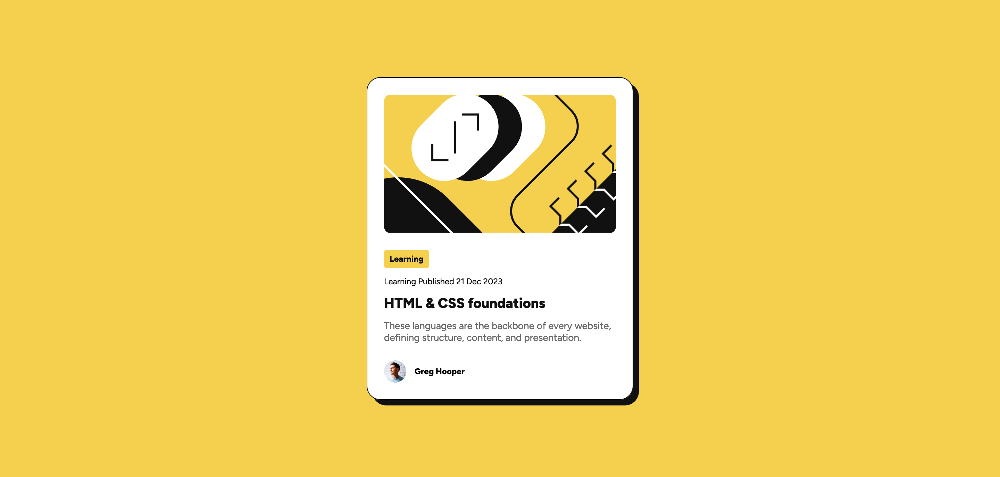

# Frontend Mentor - Blog preview card solution

This is a solution to the [Blog preview card challenge on Frontend Mentor](https://www.frontendmentor.io/challenges/blog-preview-card-ckPaj01IcS). Frontend Mentor challenges help you improve your coding skills by building realistic projects.

## Table of contents

- [Overview](#overview)
  - [The challenge](#the-challenge)
  - [Screenshot](#screenshot)
  - [Links](#links)
- [My process](#my-process)
  - [Built with](#built-with)
  - [What I learned](#what-i-learned)
  - [Useful resources](#useful-resources)
- [Author](#author)

## Overview

### The challenge

Users should be able to:

- See hover and focus states for all interactive elements on the page

### Screenshot

### Links

- Solution URL: [Solution URL here](https://github.com/priyavrat8065/blog-preview-card)
- Live Site URL: [Live site URL here](https://priyavrat8065.github.io/blog-preview-card/)

## My process

### Built with

- Semantic HTML5 markup
- CSS custom properties
- Flexbox
- CSS Grid

### What I learned

In this project i learnt how to use flexbox to perfectly layout different flex items. I also learnt how to use css variables in this project.

### Useful resources

- [This mdn resource](https://developer.mozilla.org/en-US/docs/Web/CSS/box-shadow) helped me how to add shadow to the card in this project..

## Author

- Frontend Mentor - [@priyavrat8065](https://www.frontendmentor.io/profile/priyavrat8065)

